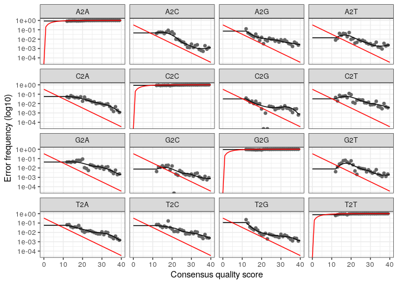
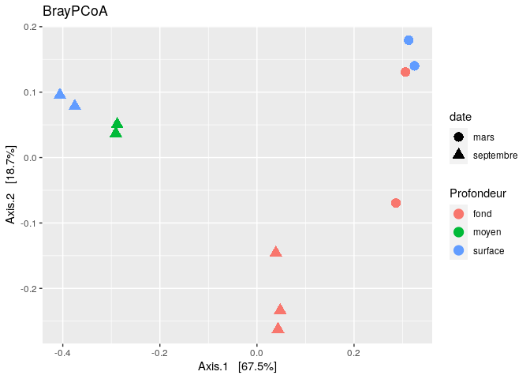
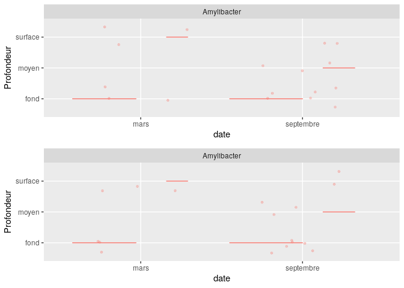

R Notebook
================

  - [Analyse qualité des reads](#analyse-qualité-des-reads)
      - [Calcul du modèle d’erreur](#calcul-du-modèle-derreur)
  - [Apliccation du modèle d’erreur](#apliccation-du-modèle-derreur)
  - [Assemblage des reads](#assemblage-des-reads)
  - [Contruction de la table de
    séquence](#contruction-de-la-table-de-séquence)
  - [Identification et retrait des
    chimères](#identification-et-retrait-des-chimères)
  - [Pipeline](#pipeline)
  - [Assignation taxonomique](#assignation-taxonomique)
  - [Alignement de séquences](#alignement-de-séquences)
  - [Phyloseq](#phyloseq)

``` r
library(dada2)
```

    ## Loading required package: Rcpp

    ## Warning: multiple methods tables found for 'which'

``` r
path <- "~/Git/CC2_Final/data"
list.files(path)
```

    ##  [1] "filtered"                            "Station5_Fond1_10sept14_R1.fastq"   
    ##  [3] "Station5_Fond1_10sept14_R2.fastq"    "Station5_Fond1_11mars15_R1.fastq"   
    ##  [5] "Station5_Fond1_11mars15_R2.fastq"    "Station5_Fond2_10sept14_R1.fastq"   
    ##  [7] "Station5_Fond2_10sept14_R2.fastq"    "Station5_Fond2_11mars15_R1.fastq"   
    ##  [9] "Station5_Fond2_11mars15_R2.fastq"    "Station5_Fond3_10sept14_R1.fastq"   
    ## [11] "Station5_Fond3_10sept14_R2.fastq"    "Station5_Median1_10sept14_R1.fastq" 
    ## [13] "Station5_Median1_10sept14_R2.fastq"  "Station5_Median2_10sept14_R1.fastq" 
    ## [15] "Station5_Median2_10sept14_R2.fastq"  "Station5_Surface1_10sept14_R1.fastq"
    ## [17] "Station5_Surface1_10sept14_R2.fastq" "Station5_Surface1_11mars15_R1.fastq"
    ## [19] "Station5_Surface1_11mars15_R2.fastq" "Station5_Surface2_10sept14_R1.fastq"
    ## [21] "Station5_Surface2_10sept14_R2.fastq" "Station5_Surface2_11mars15_R1.fastq"
    ## [23] "Station5_Surface2_11mars15_R2.fastq"

Après avoir dézipper notre jeu de données, on va l’importer dans un
objet path qui regroupera les différentes données.

``` r
fnFs <- sort(list.files(path, pattern="1.fastq", full.names = TRUE))
fnRs <- sort(list.files(path, pattern="2.fastq", full.names = TRUE))
sample.namesFs <- sapply(strsplit(basename(fnFs), "\\."), `[`, 1)
sample.namesRs <- sapply(strsplit(basename(fnRs), "\\."), `[`, 1)
sample.namesFs
```

    ##  [1] "Station5_Fond1_10sept14_R1"    "Station5_Fond1_11mars15_R1"   
    ##  [3] "Station5_Fond2_10sept14_R1"    "Station5_Fond2_11mars15_R1"   
    ##  [5] "Station5_Fond3_10sept14_R1"    "Station5_Median1_10sept14_R1" 
    ##  [7] "Station5_Median2_10sept14_R1"  "Station5_Surface1_10sept14_R1"
    ##  [9] "Station5_Surface1_11mars15_R1" "Station5_Surface2_10sept14_R1"
    ## [11] "Station5_Surface2_11mars15_R1"

``` r
sample.namesRs
```

    ##  [1] "Station5_Fond1_10sept14_R2"    "Station5_Fond1_11mars15_R2"   
    ##  [3] "Station5_Fond2_10sept14_R2"    "Station5_Fond2_11mars15_R2"   
    ##  [5] "Station5_Fond3_10sept14_R2"    "Station5_Median1_10sept14_R2" 
    ##  [7] "Station5_Median2_10sept14_R2"  "Station5_Surface1_10sept14_R2"
    ##  [9] "Station5_Surface1_11mars15_R2" "Station5_Surface2_10sept14_R2"
    ## [11] "Station5_Surface2_11mars15_R2"

On va séparer notre jeu de données en plaçant dans un objet fnFs tous
les reads foward, donc les reads 1. On placera donc dans un objet fnRs
tous les reads reverse, donc les reads 2

# Analyse qualité des reads

``` r
plotQualityProfile(fnFs[1:2])
```

<!-- -->

``` r
plotQualityProfile(fnRs[1:2])
```

<!-- --> Avec
cette fonction on va regarder les scores qualités de nos deux premières
données présentes dans fnFs et fnRs. Un plot sera donc réalisé
permettant de visualiser le profil qualité de ces séquences. On retrouve
le score qualité en ordonnée et la longueur des séquences en abscisse.
La ligne verte correspond au score de qualité des nucléotides de chaque
séquence. La ligne orange représente la longueur de chaque read (sachant
qu’avec illumina on a des read de 250 pb). On remarque que les read
Forwards ont un bon score de qualité qui ne semble pas descendre en
desosus du Q30 avant les 230-240 pb. Pour les reads Reverse on remarque
que les score qualités sont un peu moins bon. En effet ils descendent en
dessous du Q30 vers les 200 pb.

``` r
filtFs <- file.path(path, "filtered", paste0(sample.namesFs, "_R1.fastq"))
filtRs <- file.path(path, "filtered", paste0(sample.namesRs, "_R2.fastq"))
names(filtFs) <- sample.namesFs
names(filtRs) <- sample.namesRs
filtFs
```

    ##                                             Station5_Fond1_10sept14_R1 
    ##    "~/Git/CC2_Final/data/filtered/Station5_Fond1_10sept14_R1_R1.fastq" 
    ##                                             Station5_Fond1_11mars15_R1 
    ##    "~/Git/CC2_Final/data/filtered/Station5_Fond1_11mars15_R1_R1.fastq" 
    ##                                             Station5_Fond2_10sept14_R1 
    ##    "~/Git/CC2_Final/data/filtered/Station5_Fond2_10sept14_R1_R1.fastq" 
    ##                                             Station5_Fond2_11mars15_R1 
    ##    "~/Git/CC2_Final/data/filtered/Station5_Fond2_11mars15_R1_R1.fastq" 
    ##                                             Station5_Fond3_10sept14_R1 
    ##    "~/Git/CC2_Final/data/filtered/Station5_Fond3_10sept14_R1_R1.fastq" 
    ##                                           Station5_Median1_10sept14_R1 
    ##  "~/Git/CC2_Final/data/filtered/Station5_Median1_10sept14_R1_R1.fastq" 
    ##                                           Station5_Median2_10sept14_R1 
    ##  "~/Git/CC2_Final/data/filtered/Station5_Median2_10sept14_R1_R1.fastq" 
    ##                                          Station5_Surface1_10sept14_R1 
    ## "~/Git/CC2_Final/data/filtered/Station5_Surface1_10sept14_R1_R1.fastq" 
    ##                                          Station5_Surface1_11mars15_R1 
    ## "~/Git/CC2_Final/data/filtered/Station5_Surface1_11mars15_R1_R1.fastq" 
    ##                                          Station5_Surface2_10sept14_R1 
    ## "~/Git/CC2_Final/data/filtered/Station5_Surface2_10sept14_R1_R1.fastq" 
    ##                                          Station5_Surface2_11mars15_R1 
    ## "~/Git/CC2_Final/data/filtered/Station5_Surface2_11mars15_R1_R1.fastq"

``` r
filtRs
```

    ##                                             Station5_Fond1_10sept14_R2 
    ##    "~/Git/CC2_Final/data/filtered/Station5_Fond1_10sept14_R2_R2.fastq" 
    ##                                             Station5_Fond1_11mars15_R2 
    ##    "~/Git/CC2_Final/data/filtered/Station5_Fond1_11mars15_R2_R2.fastq" 
    ##                                             Station5_Fond2_10sept14_R2 
    ##    "~/Git/CC2_Final/data/filtered/Station5_Fond2_10sept14_R2_R2.fastq" 
    ##                                             Station5_Fond2_11mars15_R2 
    ##    "~/Git/CC2_Final/data/filtered/Station5_Fond2_11mars15_R2_R2.fastq" 
    ##                                             Station5_Fond3_10sept14_R2 
    ##    "~/Git/CC2_Final/data/filtered/Station5_Fond3_10sept14_R2_R2.fastq" 
    ##                                           Station5_Median1_10sept14_R2 
    ##  "~/Git/CC2_Final/data/filtered/Station5_Median1_10sept14_R2_R2.fastq" 
    ##                                           Station5_Median2_10sept14_R2 
    ##  "~/Git/CC2_Final/data/filtered/Station5_Median2_10sept14_R2_R2.fastq" 
    ##                                          Station5_Surface1_10sept14_R2 
    ## "~/Git/CC2_Final/data/filtered/Station5_Surface1_10sept14_R2_R2.fastq" 
    ##                                          Station5_Surface1_11mars15_R2 
    ## "~/Git/CC2_Final/data/filtered/Station5_Surface1_11mars15_R2_R2.fastq" 
    ##                                          Station5_Surface2_10sept14_R2 
    ## "~/Git/CC2_Final/data/filtered/Station5_Surface2_10sept14_R2_R2.fastq" 
    ##                                          Station5_Surface2_11mars15_R2 
    ## "~/Git/CC2_Final/data/filtered/Station5_Surface2_11mars15_R2_R2.fastq"

Cette fonction permet de ranger les fichiers dans un dossiers filtered
avec des objets filtFs et Rs respectivement pour les fichiers Forward et
Reverse.

``` r
out <- filterAndTrim(fnFs, filtFs, fnRs, filtRs, trimLeft= 21, truncLen=c(240,200),
              maxN=0, maxEE=c(2,2), truncQ=2, rm.phix=TRUE,
              compress=TRUE, multithread=TRUE)
head(out)
```

    ##                                    reads.in reads.out
    ## Station5_Fond1_10sept14_R1.fastq     159971    145448
    ## Station5_Fond1_11mars15_R1.fastq     175993    160423
    ## Station5_Fond2_10sept14_R1.fastq     197039    177018
    ## Station5_Fond2_11mars15_R1.fastq      87585     79989
    ## Station5_Fond3_10sept14_R1.fastq     117140    106150
    ## Station5_Median1_10sept14_R1.fastq   116519    106745

Cette fonction va nous permettre de couper et de filtrer nos reads grâce
au filterAndTrim. La fonction truncLen va permettre de couper les reads
forward et reverse à l’endroit indiqué. Nous avons choisi de couper les
reads Forwards à 240 pb et les reads Reverses à 200 pb. En effet nous
avons vu précédement qu’au delà de 240 pb les scores qualité n’étaient
pas bon pour les forwards (200 pb pour les reads reverses). La fonction
maxEE=c(2,2) va nous permettre d’écarter les reads avec un score de
qualité inférieur à Q20, c’est à dire les séquences ayant 1 erreur
toutes les 100 paires de bases en moyenne. Le timLeft va permettre
d’enlever les primer sur nos reads Forwards et Reverses. La valeur du
reads.in nous indique le nombre de reads initial et reads.out le nombre
de reads apres filtrage qualité. On peut voir qu’on ne perds pas
beaucoup de reads.

## Calcul du modèle d’erreur

``` r
errF <- learnErrors(filtFs, multithread=TRUE)
```

    ## 105752691 total bases in 482889 reads from 3 samples will be used for learning the error rates.

``` r
errR <- learnErrors(filtRs, multithread=TRUE)
```

    ## 100755162 total bases in 562878 reads from 4 samples will be used for learning the error rates.

LearnErrors va permettre de générer un algorithme mathématique avec nos
données filtrées dans filtFs et filtRs. Ca va permettre de créer un
modèle d’erreur permettant par la suite de corriger les erreurs sur nos
reads.

``` r
plotErrors(errF, nominalQ = TRUE)
```

    ## Warning: Transformation introduced infinite values in continuous y-axis
    
    ## Warning: Transformation introduced infinite values in continuous y-axis

<!-- -->

``` r
plotErrors(errR, nominalQ = TRUE)
```

    ## Warning: Transformation introduced infinite values in continuous y-axis
    
    ## Warning: Transformation introduced infinite values in continuous y-axis

<!-- --> On a
tracer des graphiques reprèsentant les erreurs sur nos différentes reads
(forwards et reverses). Avec un score de qualité très haut, la
probabilité que A donne un A est très forte (visible sur le graphique
A2A). Sur le graphique A2C nous verrons la probabilité que A ait donné
un C et ainsi dessuite. Il sera donc possible de visualiser les
probabilité de chaque nucléotide en donne un autre. Ainsi Plus le Q
score augmente et plus la probabilité qu’il y ait une substitution est
faible. Illumina fait des erreurs de lecture, c’est pour cette raison
qu’appliquer ce modèle mathématique permettra de corriger ces erreurs.
En revanche il faut avoir conscience que ce modèle ne va pas permerttre
de corriger toutes les erreurs et qu’il peut en créer, par exemple en
corrigeant une base par une autre en la prennant pour une erreur de
lecture alors qu’elle pourrait être un variant naturelle de cette
séquence. La courbe en noire correspond au modèle mathématique que
Dada2 a créée.

# Apliccation du modèle d’erreur

``` r
dadaFs <- dada(filtFs, err=errF, multithread=TRUE)
```

    ## Sample 1 - 145448 reads in 37907 unique sequences.
    ## Sample 2 - 160423 reads in 35863 unique sequences.
    ## Sample 3 - 177018 reads in 47212 unique sequences.
    ## Sample 4 - 79989 reads in 20356 unique sequences.
    ## Sample 5 - 106150 reads in 30255 unique sequences.
    ## Sample 6 - 106745 reads in 28836 unique sequences.
    ## Sample 7 - 98823 reads in 25824 unique sequences.
    ## Sample 8 - 107427 reads in 26733 unique sequences.
    ## Sample 9 - 71082 reads in 17976 unique sequences.
    ## Sample 10 - 78645 reads in 20422 unique sequences.
    ## Sample 11 - 91534 reads in 24487 unique sequences.

Cette fonction permet d’appliquer notre modèle mathématique à nos
séquences Forwards.

``` r
dadaRs <- dada(filtRs, err=errR, multithread=TRUE)
```

    ## Sample 1 - 145448 reads in 45486 unique sequences.
    ## Sample 2 - 160423 reads in 41638 unique sequences.
    ## Sample 3 - 177018 reads in 55554 unique sequences.
    ## Sample 4 - 79989 reads in 23239 unique sequences.
    ## Sample 5 - 106150 reads in 34625 unique sequences.
    ## Sample 6 - 106745 reads in 31673 unique sequences.
    ## Sample 7 - 98823 reads in 29093 unique sequences.
    ## Sample 8 - 107427 reads in 28947 unique sequences.
    ## Sample 9 - 71082 reads in 21426 unique sequences.
    ## Sample 10 - 78645 reads in 22051 unique sequences.
    ## Sample 11 - 91534 reads in 28266 unique sequences.

On fait la même chose pour les Reverses.

# Assemblage des reads

``` r
mergers <- mergePairs(dadaFs, filtFs, dadaRs, filtRs, verbose=TRUE)
```

    ## 117318 paired-reads (in 5196 unique pairings) successfully merged out of 141000 (in 21451 pairings) input.

    ## 138940 paired-reads (in 4296 unique pairings) successfully merged out of 156462 (in 15709 pairings) input.

    ## 142188 paired-reads (in 6989 unique pairings) successfully merged out of 171439 (in 27056 pairings) input.

    ## 67622 paired-reads (in 2721 unique pairings) successfully merged out of 77764 (in 9556 pairings) input.

    ## 83613 paired-reads (in 3458 unique pairings) successfully merged out of 102224 (in 16304 pairings) input.

    ## 86212 paired-reads (in 3348 unique pairings) successfully merged out of 103447 (in 14293 pairings) input.

    ## 80661 paired-reads (in 2727 unique pairings) successfully merged out of 95866 (in 12350 pairings) input.

    ## 89385 paired-reads (in 3073 unique pairings) successfully merged out of 104354 (in 12135 pairings) input.

    ## 59716 paired-reads (in 1939 unique pairings) successfully merged out of 68711 (in 7974 pairings) input.

    ## 66157 paired-reads (in 1763 unique pairings) successfully merged out of 76701 (in 8283 pairings) input.

    ## 75048 paired-reads (in 3149 unique pairings) successfully merged out of 88514 (in 12054 pairings) input.

Merger va permettre de fusionner les reads Forwards avec les Reverses
permettant la formation de contigs.

# Contruction de la table de séquence

``` r
seqtab <- makeSequenceTable(mergers)
dim(seqtab)
```

    ## [1]    11 19426

On va placer dans l’objet seqtab, la matrice d’observation de l’objet
issu de mergers. Il y a donc 11 lignes dans notre tableau avec 19426
colonnes.

# Identification et retrait des chimères

``` r
seqtab.nochim <- removeBimeraDenovo(seqtab, method="consensus", multithread=TRUE, verbose=TRUE)
```

    ## Identified 17869 bimeras out of 19426 input sequences.

Cette fonction va permettre d’identifier le nombre de chimère dans nos
contigs. 17869 chimères ont été détectées et seront retirées de notre
jeu de données.

``` r
dim(seqtab.nochim)
```

    ## [1]   11 1557

Ici nous avons donc le tableau de nos données qui ne contient plus que
1557 colones.

``` r
sum(seqtab.nochim)/sum(seqtab)
```

    ## [1] 0.7769154

Il nous reste donc 78% de notre jeu de données. Plus de 20% des données
étaient des chimères.

# Pipeline

``` r
getN <- function(x) sum(getUniques(x))
track <- cbind(out, sapply(dadaFs, getN), sapply(dadaRs, getN), sapply(mergers,
getN), rowSums(seqtab.nochim))
colnames(track) <- c("input", "filtered", "denoisedF", "denoisedR", "merged", "n
onchim")
rownames(track) <- sample.namesFs
head(track)
```

    ##                               input filtered denoisedF denoisedR merged
    ## Station5_Fond1_10sept14_R1   159971   145448    142931    143292 117318
    ## Station5_Fond1_11mars15_R1   175993   160423    158128    158473 138940
    ## Station5_Fond2_10sept14_R1   197039   177018    173601    174591 142188
    ## Station5_Fond2_11mars15_R1    87585    79989     78618     78926  67622
    ## Station5_Fond3_10sept14_R1   117140   106150    103806    104338  83613
    ## Station5_Median1_10sept14_R1 116519   106745    104811    105173  86212
    ##                              n\nonchim
    ## Station5_Fond1_10sept14_R1       87962
    ## Station5_Fond1_11mars15_R1      111552
    ## Station5_Fond2_10sept14_R1      103668
    ## Station5_Fond2_11mars15_R1       54711
    ## Station5_Fond3_10sept14_R1       64259
    ## Station5_Median1_10sept14_R1     65559

Track permet de voir les traitements que nous avons fais sur nos
séquences depuis le début de l’analyse Dada2. On voit qu’on passe de
159971 séquences, dans la colonne input, à 87962 séquences après
l’application du modèle d’erreur et le retrait des chimères.

# Assignation taxonomique

``` r
ref_fasta <- "silva_nr99_v138_train_set.fa.gz"
taxtab <- assignTaxonomy(seqtab.nochim, refFasta = ref_fasta)
colnames(taxtab) <- c("Kingdom", "Phylum", "Class", "Order", "Family", "Genus")
taxa <- assignTaxonomy(seqtab.nochim, "silva_nr99_v138_train_set.fa.gz", multithread=TRUE)
taxa.print <- taxtab 
rownames(taxtab) <- NULL
head(taxa.print)
```

    ##                                                                                                                                                                                                                                                                                                                                                                                          Kingdom   
    ## TACGAAGGGACCTAGCGTAGTTCGGAATTACTGGGCTTAAAGAGTTCGTAGGTGGTTGAAAAAGTTAGTGGTGAAATCCCAGAGCTTAACTCTGGAACTGCCATTAAAACTTTTCAGCTAGAGTATGATAGAGGAAAGCAGAATTTCTAGTGTAGAGGTGAAATTCGTAGATATTAGAAAGAATACCAATTGCGAAGGCAGCTTTCTGGATCATTACTGACACTGAGGAACGAAAGCATGGGTAGCGAAGAGGATTAGATACCCTCGTAGTCCATGCCGTAAACGATGTGTGTTAGACGTTGGAAATTTATTTTCAGTGTCGCAGGGAAACCGATAAACACACCGCCTGGGGAGTACGACCGCAAGGTT        "Bacteria"
    ## TACGGGAGTGGCAAGCGTTATCCGGAATTATTGGGCGTAAAGCGTCCGCAGGCGGCCCTTCAAGTCTGCTGTTAAAAAGTGGAGCTTAACTCCATCATGGCAGTGGAAACTGAGGGGCTTGAGTGTGGTAGGGGCAGAGGGAATTCCCGGTGTAGCGGTGAAATGCGTAGATATCGGGAAGAACACCAGTGGCGAAGGCGCTCTGCTGGGCCATCACTGACGCTCATGGACGAAAGCCAGGGGAGCGAAAGGGATTAGATACCCCTGTAGTCCTGGCCGTAAACGATGAACACTAGGTGTCGGGGGAATCGACCCCCTCGGTGTCGTAGCCAACGCGTTAAGTGTTCCGCCTGGGGAGTACGCACGCAAGTGT    "Bacteria"
    ## TACGAAGGGACCTAGCGTAGTTCGGAATTACTGGGCTTAAAGAGTTCGTAGGTGGTTGAAAAAGTTGGTGGTGAAATCCCAGAGCTTAACTCTGGAACTGCCATCAAAACTTTTCAGCTAGAGTTTGATAGAGGAAAGCAGAATTTCTAGTGTAGAGGTGAAATTCGTAGATATTAGAAAGAATACCAATTGCGAAGGCAGCTTTCTGGATCATTACTGACACTGAGGAACGAAAGCATGGGTAGCGAAGAGGATTAGATACCCTCGTAGTCCATGCCGTAAACGATGTGTGTTAGACGTTGGAAATTTATTTTCAGTGTCGCAGCGAAAGCGATAAACACACCGCCTGGGGAGTACGACCGCAAGGTT        "Bacteria"
    ## TACGAAGGGACCTAGCGTAGTTCGGAATTACTGGGCTTAAAGAGTTCGTAGGTGGTTGAAAAAGTTGGTGGTGAAATCCCAGAGCTTAACTCTGGAACTGCCATCAAAACTTTTCAGCTAGAGTATGATAGAGGAAAGCAGAATTTCTAGTGTAGAGGTGAAATTCGTAGATATTAGAAAGAATACCAATTGCGAAGGCAGCTTTCTGGATCATTACTGACACTGAGGAACGAAAGCATGGGTAGCGAAGAGGATTAGATACCCTCGTAGTCCATGCCGTAAACGATGTGTGTTAGACGTTGGAAATTTATTTTCAGTGTCGCAGCGAAAGCGATAAACACACCGCCTGGGGAGTACGACCGCAAGGTT        "Bacteria"
    ## TACGAAGGGACCTAGCGTAGTTCGGAATTACTGGGCTTAAAGAGCTCGTAGGTGGTTAAAAAAGTTGATGGTGAAATCCCAAGGCTCAACCTTGGAACTGCCATCAAAACTTTTTAGCTAGAGTGTGATAGAGGTAAGTGGAATTTCTAGTGTAGAGGTGAAATTCGTAGATATTAGAAAGAACACCAAATGCGAAGGCAACTTACTGGGTCACTACTGACACTGAGGAGCGAAAGCATGGGTAGCGAAGAGGATTAGATACCCTCGTAGTCCATGCCGTAAACGATGTGTGCTAGACGTTGGAAATATATTTTTCAGTGTCGCAGCGAAAGCATTAAGCACACCGCCTGGGGAGTACGACCGCAAGGTT       "Bacteria"
    ## TACATAGGGGTCAAGCGTTGTCCGGATTTATTGGGCGTAAAGAGCTCGTAGGCGGTTCAACAAGTCGGTCGTAAAAGTTTAGGGCTCAACCCTAAAATGTCGATCGATACTGTTGTGACTAGGATACGGTAGAGGTGAATGGAATTCCGAGTGTAGCGGTGAAATGCGTAGATATTCGGAGGAACACCAATTGCGAAGGCAGTTCACTGGACCGTGATCGACGCTGAGGAGCGAAAGCTAGGGGAGCAAACAGGATTAGATACCCTGGTAGTCCTAGCTGTAAACGATGGATACTAGATGTAGGAACTGGATTGACGGTTTCTGTATCGTAGCTAACGCGTTAAGTATCCCGCCTGGGGAGTACGGTCGCAAGACT "Bacteria"
    ##                                                                                                                                                                                                                                                                                                                                                                                          Phylum            
    ## TACGAAGGGACCTAGCGTAGTTCGGAATTACTGGGCTTAAAGAGTTCGTAGGTGGTTGAAAAAGTTAGTGGTGAAATCCCAGAGCTTAACTCTGGAACTGCCATTAAAACTTTTCAGCTAGAGTATGATAGAGGAAAGCAGAATTTCTAGTGTAGAGGTGAAATTCGTAGATATTAGAAAGAATACCAATTGCGAAGGCAGCTTTCTGGATCATTACTGACACTGAGGAACGAAAGCATGGGTAGCGAAGAGGATTAGATACCCTCGTAGTCCATGCCGTAAACGATGTGTGTTAGACGTTGGAAATTTATTTTCAGTGTCGCAGGGAAACCGATAAACACACCGCCTGGGGAGTACGACCGCAAGGTT        "Proteobacteria"  
    ## TACGGGAGTGGCAAGCGTTATCCGGAATTATTGGGCGTAAAGCGTCCGCAGGCGGCCCTTCAAGTCTGCTGTTAAAAAGTGGAGCTTAACTCCATCATGGCAGTGGAAACTGAGGGGCTTGAGTGTGGTAGGGGCAGAGGGAATTCCCGGTGTAGCGGTGAAATGCGTAGATATCGGGAAGAACACCAGTGGCGAAGGCGCTCTGCTGGGCCATCACTGACGCTCATGGACGAAAGCCAGGGGAGCGAAAGGGATTAGATACCCCTGTAGTCCTGGCCGTAAACGATGAACACTAGGTGTCGGGGGAATCGACCCCCTCGGTGTCGTAGCCAACGCGTTAAGTGTTCCGCCTGGGGAGTACGCACGCAAGTGT    "Cyanobacteria"   
    ## TACGAAGGGACCTAGCGTAGTTCGGAATTACTGGGCTTAAAGAGTTCGTAGGTGGTTGAAAAAGTTGGTGGTGAAATCCCAGAGCTTAACTCTGGAACTGCCATCAAAACTTTTCAGCTAGAGTTTGATAGAGGAAAGCAGAATTTCTAGTGTAGAGGTGAAATTCGTAGATATTAGAAAGAATACCAATTGCGAAGGCAGCTTTCTGGATCATTACTGACACTGAGGAACGAAAGCATGGGTAGCGAAGAGGATTAGATACCCTCGTAGTCCATGCCGTAAACGATGTGTGTTAGACGTTGGAAATTTATTTTCAGTGTCGCAGCGAAAGCGATAAACACACCGCCTGGGGAGTACGACCGCAAGGTT        "Proteobacteria"  
    ## TACGAAGGGACCTAGCGTAGTTCGGAATTACTGGGCTTAAAGAGTTCGTAGGTGGTTGAAAAAGTTGGTGGTGAAATCCCAGAGCTTAACTCTGGAACTGCCATCAAAACTTTTCAGCTAGAGTATGATAGAGGAAAGCAGAATTTCTAGTGTAGAGGTGAAATTCGTAGATATTAGAAAGAATACCAATTGCGAAGGCAGCTTTCTGGATCATTACTGACACTGAGGAACGAAAGCATGGGTAGCGAAGAGGATTAGATACCCTCGTAGTCCATGCCGTAAACGATGTGTGTTAGACGTTGGAAATTTATTTTCAGTGTCGCAGCGAAAGCGATAAACACACCGCCTGGGGAGTACGACCGCAAGGTT        "Proteobacteria"  
    ## TACGAAGGGACCTAGCGTAGTTCGGAATTACTGGGCTTAAAGAGCTCGTAGGTGGTTAAAAAAGTTGATGGTGAAATCCCAAGGCTCAACCTTGGAACTGCCATCAAAACTTTTTAGCTAGAGTGTGATAGAGGTAAGTGGAATTTCTAGTGTAGAGGTGAAATTCGTAGATATTAGAAAGAACACCAAATGCGAAGGCAACTTACTGGGTCACTACTGACACTGAGGAGCGAAAGCATGGGTAGCGAAGAGGATTAGATACCCTCGTAGTCCATGCCGTAAACGATGTGTGCTAGACGTTGGAAATATATTTTTCAGTGTCGCAGCGAAAGCATTAAGCACACCGCCTGGGGAGTACGACCGCAAGGTT       "Proteobacteria"  
    ## TACATAGGGGTCAAGCGTTGTCCGGATTTATTGGGCGTAAAGAGCTCGTAGGCGGTTCAACAAGTCGGTCGTAAAAGTTTAGGGCTCAACCCTAAAATGTCGATCGATACTGTTGTGACTAGGATACGGTAGAGGTGAATGGAATTCCGAGTGTAGCGGTGAAATGCGTAGATATTCGGAGGAACACCAATTGCGAAGGCAGTTCACTGGACCGTGATCGACGCTGAGGAGCGAAAGCTAGGGGAGCAAACAGGATTAGATACCCTGGTAGTCCTAGCTGTAAACGATGGATACTAGATGTAGGAACTGGATTGACGGTTTCTGTATCGTAGCTAACGCGTTAAGTATCCCGCCTGGGGAGTACGGTCGCAAGACT "Actinobacteriota"
    ##                                                                                                                                                                                                                                                                                                                                                                                          Class                
    ## TACGAAGGGACCTAGCGTAGTTCGGAATTACTGGGCTTAAAGAGTTCGTAGGTGGTTGAAAAAGTTAGTGGTGAAATCCCAGAGCTTAACTCTGGAACTGCCATTAAAACTTTTCAGCTAGAGTATGATAGAGGAAAGCAGAATTTCTAGTGTAGAGGTGAAATTCGTAGATATTAGAAAGAATACCAATTGCGAAGGCAGCTTTCTGGATCATTACTGACACTGAGGAACGAAAGCATGGGTAGCGAAGAGGATTAGATACCCTCGTAGTCCATGCCGTAAACGATGTGTGTTAGACGTTGGAAATTTATTTTCAGTGTCGCAGGGAAACCGATAAACACACCGCCTGGGGAGTACGACCGCAAGGTT        "Alphaproteobacteria"
    ## TACGGGAGTGGCAAGCGTTATCCGGAATTATTGGGCGTAAAGCGTCCGCAGGCGGCCCTTCAAGTCTGCTGTTAAAAAGTGGAGCTTAACTCCATCATGGCAGTGGAAACTGAGGGGCTTGAGTGTGGTAGGGGCAGAGGGAATTCCCGGTGTAGCGGTGAAATGCGTAGATATCGGGAAGAACACCAGTGGCGAAGGCGCTCTGCTGGGCCATCACTGACGCTCATGGACGAAAGCCAGGGGAGCGAAAGGGATTAGATACCCCTGTAGTCCTGGCCGTAAACGATGAACACTAGGTGTCGGGGGAATCGACCCCCTCGGTGTCGTAGCCAACGCGTTAAGTGTTCCGCCTGGGGAGTACGCACGCAAGTGT    "Cyanobacteriia"     
    ## TACGAAGGGACCTAGCGTAGTTCGGAATTACTGGGCTTAAAGAGTTCGTAGGTGGTTGAAAAAGTTGGTGGTGAAATCCCAGAGCTTAACTCTGGAACTGCCATCAAAACTTTTCAGCTAGAGTTTGATAGAGGAAAGCAGAATTTCTAGTGTAGAGGTGAAATTCGTAGATATTAGAAAGAATACCAATTGCGAAGGCAGCTTTCTGGATCATTACTGACACTGAGGAACGAAAGCATGGGTAGCGAAGAGGATTAGATACCCTCGTAGTCCATGCCGTAAACGATGTGTGTTAGACGTTGGAAATTTATTTTCAGTGTCGCAGCGAAAGCGATAAACACACCGCCTGGGGAGTACGACCGCAAGGTT        "Alphaproteobacteria"
    ## TACGAAGGGACCTAGCGTAGTTCGGAATTACTGGGCTTAAAGAGTTCGTAGGTGGTTGAAAAAGTTGGTGGTGAAATCCCAGAGCTTAACTCTGGAACTGCCATCAAAACTTTTCAGCTAGAGTATGATAGAGGAAAGCAGAATTTCTAGTGTAGAGGTGAAATTCGTAGATATTAGAAAGAATACCAATTGCGAAGGCAGCTTTCTGGATCATTACTGACACTGAGGAACGAAAGCATGGGTAGCGAAGAGGATTAGATACCCTCGTAGTCCATGCCGTAAACGATGTGTGTTAGACGTTGGAAATTTATTTTCAGTGTCGCAGCGAAAGCGATAAACACACCGCCTGGGGAGTACGACCGCAAGGTT        "Alphaproteobacteria"
    ## TACGAAGGGACCTAGCGTAGTTCGGAATTACTGGGCTTAAAGAGCTCGTAGGTGGTTAAAAAAGTTGATGGTGAAATCCCAAGGCTCAACCTTGGAACTGCCATCAAAACTTTTTAGCTAGAGTGTGATAGAGGTAAGTGGAATTTCTAGTGTAGAGGTGAAATTCGTAGATATTAGAAAGAACACCAAATGCGAAGGCAACTTACTGGGTCACTACTGACACTGAGGAGCGAAAGCATGGGTAGCGAAGAGGATTAGATACCCTCGTAGTCCATGCCGTAAACGATGTGTGCTAGACGTTGGAAATATATTTTTCAGTGTCGCAGCGAAAGCATTAAGCACACCGCCTGGGGAGTACGACCGCAAGGTT       "Alphaproteobacteria"
    ## TACATAGGGGTCAAGCGTTGTCCGGATTTATTGGGCGTAAAGAGCTCGTAGGCGGTTCAACAAGTCGGTCGTAAAAGTTTAGGGCTCAACCCTAAAATGTCGATCGATACTGTTGTGACTAGGATACGGTAGAGGTGAATGGAATTCCGAGTGTAGCGGTGAAATGCGTAGATATTCGGAGGAACACCAATTGCGAAGGCAGTTCACTGGACCGTGATCGACGCTGAGGAGCGAAAGCTAGGGGAGCAAACAGGATTAGATACCCTGGTAGTCCTAGCTGTAAACGATGGATACTAGATGTAGGAACTGGATTGACGGTTTCTGTATCGTAGCTAACGCGTTAAGTATCCCGCCTGGGGAGTACGGTCGCAAGACT "Acidimicrobiia"     
    ##                                                                                                                                                                                                                                                                                                                                                                                          Order            
    ## TACGAAGGGACCTAGCGTAGTTCGGAATTACTGGGCTTAAAGAGTTCGTAGGTGGTTGAAAAAGTTAGTGGTGAAATCCCAGAGCTTAACTCTGGAACTGCCATTAAAACTTTTCAGCTAGAGTATGATAGAGGAAAGCAGAATTTCTAGTGTAGAGGTGAAATTCGTAGATATTAGAAAGAATACCAATTGCGAAGGCAGCTTTCTGGATCATTACTGACACTGAGGAACGAAAGCATGGGTAGCGAAGAGGATTAGATACCCTCGTAGTCCATGCCGTAAACGATGTGTGTTAGACGTTGGAAATTTATTTTCAGTGTCGCAGGGAAACCGATAAACACACCGCCTGGGGAGTACGACCGCAAGGTT        "SAR11 clade"    
    ## TACGGGAGTGGCAAGCGTTATCCGGAATTATTGGGCGTAAAGCGTCCGCAGGCGGCCCTTCAAGTCTGCTGTTAAAAAGTGGAGCTTAACTCCATCATGGCAGTGGAAACTGAGGGGCTTGAGTGTGGTAGGGGCAGAGGGAATTCCCGGTGTAGCGGTGAAATGCGTAGATATCGGGAAGAACACCAGTGGCGAAGGCGCTCTGCTGGGCCATCACTGACGCTCATGGACGAAAGCCAGGGGAGCGAAAGGGATTAGATACCCCTGTAGTCCTGGCCGTAAACGATGAACACTAGGTGTCGGGGGAATCGACCCCCTCGGTGTCGTAGCCAACGCGTTAAGTGTTCCGCCTGGGGAGTACGCACGCAAGTGT    "Synechococcales"
    ## TACGAAGGGACCTAGCGTAGTTCGGAATTACTGGGCTTAAAGAGTTCGTAGGTGGTTGAAAAAGTTGGTGGTGAAATCCCAGAGCTTAACTCTGGAACTGCCATCAAAACTTTTCAGCTAGAGTTTGATAGAGGAAAGCAGAATTTCTAGTGTAGAGGTGAAATTCGTAGATATTAGAAAGAATACCAATTGCGAAGGCAGCTTTCTGGATCATTACTGACACTGAGGAACGAAAGCATGGGTAGCGAAGAGGATTAGATACCCTCGTAGTCCATGCCGTAAACGATGTGTGTTAGACGTTGGAAATTTATTTTCAGTGTCGCAGCGAAAGCGATAAACACACCGCCTGGGGAGTACGACCGCAAGGTT        "SAR11 clade"    
    ## TACGAAGGGACCTAGCGTAGTTCGGAATTACTGGGCTTAAAGAGTTCGTAGGTGGTTGAAAAAGTTGGTGGTGAAATCCCAGAGCTTAACTCTGGAACTGCCATCAAAACTTTTCAGCTAGAGTATGATAGAGGAAAGCAGAATTTCTAGTGTAGAGGTGAAATTCGTAGATATTAGAAAGAATACCAATTGCGAAGGCAGCTTTCTGGATCATTACTGACACTGAGGAACGAAAGCATGGGTAGCGAAGAGGATTAGATACCCTCGTAGTCCATGCCGTAAACGATGTGTGTTAGACGTTGGAAATTTATTTTCAGTGTCGCAGCGAAAGCGATAAACACACCGCCTGGGGAGTACGACCGCAAGGTT        "SAR11 clade"    
    ## TACGAAGGGACCTAGCGTAGTTCGGAATTACTGGGCTTAAAGAGCTCGTAGGTGGTTAAAAAAGTTGATGGTGAAATCCCAAGGCTCAACCTTGGAACTGCCATCAAAACTTTTTAGCTAGAGTGTGATAGAGGTAAGTGGAATTTCTAGTGTAGAGGTGAAATTCGTAGATATTAGAAAGAACACCAAATGCGAAGGCAACTTACTGGGTCACTACTGACACTGAGGAGCGAAAGCATGGGTAGCGAAGAGGATTAGATACCCTCGTAGTCCATGCCGTAAACGATGTGTGCTAGACGTTGGAAATATATTTTTCAGTGTCGCAGCGAAAGCATTAAGCACACCGCCTGGGGAGTACGACCGCAAGGTT       "SAR11 clade"    
    ## TACATAGGGGTCAAGCGTTGTCCGGATTTATTGGGCGTAAAGAGCTCGTAGGCGGTTCAACAAGTCGGTCGTAAAAGTTTAGGGCTCAACCCTAAAATGTCGATCGATACTGTTGTGACTAGGATACGGTAGAGGTGAATGGAATTCCGAGTGTAGCGGTGAAATGCGTAGATATTCGGAGGAACACCAATTGCGAAGGCAGTTCACTGGACCGTGATCGACGCTGAGGAGCGAAAGCTAGGGGAGCAAACAGGATTAGATACCCTGGTAGTCCTAGCTGTAAACGATGGATACTAGATGTAGGAACTGGATTGACGGTTTCTGTATCGTAGCTAACGCGTTAAGTATCCCGCCTGGGGAGTACGGTCGCAAGACT "Actinomarinales"
    ##                                                                                                                                                                                                                                                                                                                                                                                          Family            
    ## TACGAAGGGACCTAGCGTAGTTCGGAATTACTGGGCTTAAAGAGTTCGTAGGTGGTTGAAAAAGTTAGTGGTGAAATCCCAGAGCTTAACTCTGGAACTGCCATTAAAACTTTTCAGCTAGAGTATGATAGAGGAAAGCAGAATTTCTAGTGTAGAGGTGAAATTCGTAGATATTAGAAAGAATACCAATTGCGAAGGCAGCTTTCTGGATCATTACTGACACTGAGGAACGAAAGCATGGGTAGCGAAGAGGATTAGATACCCTCGTAGTCCATGCCGTAAACGATGTGTGTTAGACGTTGGAAATTTATTTTCAGTGTCGCAGGGAAACCGATAAACACACCGCCTGGGGAGTACGACCGCAAGGTT        "Clade I"         
    ## TACGGGAGTGGCAAGCGTTATCCGGAATTATTGGGCGTAAAGCGTCCGCAGGCGGCCCTTCAAGTCTGCTGTTAAAAAGTGGAGCTTAACTCCATCATGGCAGTGGAAACTGAGGGGCTTGAGTGTGGTAGGGGCAGAGGGAATTCCCGGTGTAGCGGTGAAATGCGTAGATATCGGGAAGAACACCAGTGGCGAAGGCGCTCTGCTGGGCCATCACTGACGCTCATGGACGAAAGCCAGGGGAGCGAAAGGGATTAGATACCCCTGTAGTCCTGGCCGTAAACGATGAACACTAGGTGTCGGGGGAATCGACCCCCTCGGTGTCGTAGCCAACGCGTTAAGTGTTCCGCCTGGGGAGTACGCACGCAAGTGT    "Cyanobiaceae"    
    ## TACGAAGGGACCTAGCGTAGTTCGGAATTACTGGGCTTAAAGAGTTCGTAGGTGGTTGAAAAAGTTGGTGGTGAAATCCCAGAGCTTAACTCTGGAACTGCCATCAAAACTTTTCAGCTAGAGTTTGATAGAGGAAAGCAGAATTTCTAGTGTAGAGGTGAAATTCGTAGATATTAGAAAGAATACCAATTGCGAAGGCAGCTTTCTGGATCATTACTGACACTGAGGAACGAAAGCATGGGTAGCGAAGAGGATTAGATACCCTCGTAGTCCATGCCGTAAACGATGTGTGTTAGACGTTGGAAATTTATTTTCAGTGTCGCAGCGAAAGCGATAAACACACCGCCTGGGGAGTACGACCGCAAGGTT        "Clade I"         
    ## TACGAAGGGACCTAGCGTAGTTCGGAATTACTGGGCTTAAAGAGTTCGTAGGTGGTTGAAAAAGTTGGTGGTGAAATCCCAGAGCTTAACTCTGGAACTGCCATCAAAACTTTTCAGCTAGAGTATGATAGAGGAAAGCAGAATTTCTAGTGTAGAGGTGAAATTCGTAGATATTAGAAAGAATACCAATTGCGAAGGCAGCTTTCTGGATCATTACTGACACTGAGGAACGAAAGCATGGGTAGCGAAGAGGATTAGATACCCTCGTAGTCCATGCCGTAAACGATGTGTGTTAGACGTTGGAAATTTATTTTCAGTGTCGCAGCGAAAGCGATAAACACACCGCCTGGGGAGTACGACCGCAAGGTT        "Clade I"         
    ## TACGAAGGGACCTAGCGTAGTTCGGAATTACTGGGCTTAAAGAGCTCGTAGGTGGTTAAAAAAGTTGATGGTGAAATCCCAAGGCTCAACCTTGGAACTGCCATCAAAACTTTTTAGCTAGAGTGTGATAGAGGTAAGTGGAATTTCTAGTGTAGAGGTGAAATTCGTAGATATTAGAAAGAACACCAAATGCGAAGGCAACTTACTGGGTCACTACTGACACTGAGGAGCGAAAGCATGGGTAGCGAAGAGGATTAGATACCCTCGTAGTCCATGCCGTAAACGATGTGTGCTAGACGTTGGAAATATATTTTTCAGTGTCGCAGCGAAAGCATTAAGCACACCGCCTGGGGAGTACGACCGCAAGGTT       "Clade II"        
    ## TACATAGGGGTCAAGCGTTGTCCGGATTTATTGGGCGTAAAGAGCTCGTAGGCGGTTCAACAAGTCGGTCGTAAAAGTTTAGGGCTCAACCCTAAAATGTCGATCGATACTGTTGTGACTAGGATACGGTAGAGGTGAATGGAATTCCGAGTGTAGCGGTGAAATGCGTAGATATTCGGAGGAACACCAATTGCGAAGGCAGTTCACTGGACCGTGATCGACGCTGAGGAGCGAAAGCTAGGGGAGCAAACAGGATTAGATACCCTGGTAGTCCTAGCTGTAAACGATGGATACTAGATGTAGGAACTGGATTGACGGTTTCTGTATCGTAGCTAACGCGTTAAGTATCCCGCCTGGGGAGTACGGTCGCAAGACT "Actinomarinaceae"
    ##                                                                                                                                                                                                                                                                                                                                                                                          Genus                    
    ## TACGAAGGGACCTAGCGTAGTTCGGAATTACTGGGCTTAAAGAGTTCGTAGGTGGTTGAAAAAGTTAGTGGTGAAATCCCAGAGCTTAACTCTGGAACTGCCATTAAAACTTTTCAGCTAGAGTATGATAGAGGAAAGCAGAATTTCTAGTGTAGAGGTGAAATTCGTAGATATTAGAAAGAATACCAATTGCGAAGGCAGCTTTCTGGATCATTACTGACACTGAGGAACGAAAGCATGGGTAGCGAAGAGGATTAGATACCCTCGTAGTCCATGCCGTAAACGATGTGTGTTAGACGTTGGAAATTTATTTTCAGTGTCGCAGGGAAACCGATAAACACACCGCCTGGGGAGTACGACCGCAAGGTT        "Clade Ia"               
    ## TACGGGAGTGGCAAGCGTTATCCGGAATTATTGGGCGTAAAGCGTCCGCAGGCGGCCCTTCAAGTCTGCTGTTAAAAAGTGGAGCTTAACTCCATCATGGCAGTGGAAACTGAGGGGCTTGAGTGTGGTAGGGGCAGAGGGAATTCCCGGTGTAGCGGTGAAATGCGTAGATATCGGGAAGAACACCAGTGGCGAAGGCGCTCTGCTGGGCCATCACTGACGCTCATGGACGAAAGCCAGGGGAGCGAAAGGGATTAGATACCCCTGTAGTCCTGGCCGTAAACGATGAACACTAGGTGTCGGGGGAATCGACCCCCTCGGTGTCGTAGCCAACGCGTTAAGTGTTCCGCCTGGGGAGTACGCACGCAAGTGT    "Synechococcus CC9902"   
    ## TACGAAGGGACCTAGCGTAGTTCGGAATTACTGGGCTTAAAGAGTTCGTAGGTGGTTGAAAAAGTTGGTGGTGAAATCCCAGAGCTTAACTCTGGAACTGCCATCAAAACTTTTCAGCTAGAGTTTGATAGAGGAAAGCAGAATTTCTAGTGTAGAGGTGAAATTCGTAGATATTAGAAAGAATACCAATTGCGAAGGCAGCTTTCTGGATCATTACTGACACTGAGGAACGAAAGCATGGGTAGCGAAGAGGATTAGATACCCTCGTAGTCCATGCCGTAAACGATGTGTGTTAGACGTTGGAAATTTATTTTCAGTGTCGCAGCGAAAGCGATAAACACACCGCCTGGGGAGTACGACCGCAAGGTT        "Clade Ia"               
    ## TACGAAGGGACCTAGCGTAGTTCGGAATTACTGGGCTTAAAGAGTTCGTAGGTGGTTGAAAAAGTTGGTGGTGAAATCCCAGAGCTTAACTCTGGAACTGCCATCAAAACTTTTCAGCTAGAGTATGATAGAGGAAAGCAGAATTTCTAGTGTAGAGGTGAAATTCGTAGATATTAGAAAGAATACCAATTGCGAAGGCAGCTTTCTGGATCATTACTGACACTGAGGAACGAAAGCATGGGTAGCGAAGAGGATTAGATACCCTCGTAGTCCATGCCGTAAACGATGTGTGTTAGACGTTGGAAATTTATTTTCAGTGTCGCAGCGAAAGCGATAAACACACCGCCTGGGGAGTACGACCGCAAGGTT        "Clade Ia"               
    ## TACGAAGGGACCTAGCGTAGTTCGGAATTACTGGGCTTAAAGAGCTCGTAGGTGGTTAAAAAAGTTGATGGTGAAATCCCAAGGCTCAACCTTGGAACTGCCATCAAAACTTTTTAGCTAGAGTGTGATAGAGGTAAGTGGAATTTCTAGTGTAGAGGTGAAATTCGTAGATATTAGAAAGAACACCAAATGCGAAGGCAACTTACTGGGTCACTACTGACACTGAGGAGCGAAAGCATGGGTAGCGAAGAGGATTAGATACCCTCGTAGTCCATGCCGTAAACGATGTGTGCTAGACGTTGGAAATATATTTTTCAGTGTCGCAGCGAAAGCATTAAGCACACCGCCTGGGGAGTACGACCGCAAGGTT       NA                       
    ## TACATAGGGGTCAAGCGTTGTCCGGATTTATTGGGCGTAAAGAGCTCGTAGGCGGTTCAACAAGTCGGTCGTAAAAGTTTAGGGCTCAACCCTAAAATGTCGATCGATACTGTTGTGACTAGGATACGGTAGAGGTGAATGGAATTCCGAGTGTAGCGGTGAAATGCGTAGATATTCGGAGGAACACCAATTGCGAAGGCAGTTCACTGGACCGTGATCGACGCTGAGGAGCGAAAGCTAGGGGAGCAAACAGGATTAGATACCCTGGTAGTCCTAGCTGTAAACGATGGATACTAGATGTAGGAACTGGATTGACGGTTTCTGTATCGTAGCTAACGCGTTAAGTATCCCGCCTGGGGAGTACGGTCGCAAGACT "Candidatus Actinomarina"

Le fichier taxa va donc nous servir de référence taxonomique permettant
donc d’avoir une taxonomie corresponds à nos différentes séquences.

# Alignement de séquences

``` r
library(DECIPHER)
```

    ## Loading required package: Biostrings

    ## Loading required package: BiocGenerics

    ## Loading required package: parallel

    ## 
    ## Attaching package: 'BiocGenerics'

    ## The following objects are masked from 'package:parallel':
    ## 
    ##     clusterApply, clusterApplyLB, clusterCall, clusterEvalQ,
    ##     clusterExport, clusterMap, parApply, parCapply, parLapply,
    ##     parLapplyLB, parRapply, parSapply, parSapplyLB

    ## The following objects are masked from 'package:stats':
    ## 
    ##     IQR, mad, sd, var, xtabs

    ## The following objects are masked from 'package:base':
    ## 
    ##     anyDuplicated, append, as.data.frame, basename, cbind, colnames,
    ##     dirname, do.call, duplicated, eval, evalq, Filter, Find, get, grep,
    ##     grepl, intersect, is.unsorted, lapply, Map, mapply, match, mget,
    ##     order, paste, pmax, pmax.int, pmin, pmin.int, Position, rank,
    ##     rbind, Reduce, rownames, sapply, setdiff, sort, table, tapply,
    ##     union, unique, unsplit, which.max, which.min

    ## Loading required package: S4Vectors

    ## Loading required package: stats4

    ## 
    ## Attaching package: 'S4Vectors'

    ## The following object is masked from 'package:base':
    ## 
    ##     expand.grid

    ## Loading required package: IRanges

    ## Loading required package: XVector

    ## 
    ## Attaching package: 'Biostrings'

    ## The following object is masked from 'package:base':
    ## 
    ##     strsplit

    ## Loading required package: RSQLite

``` r
seqs <- getSequences(seqtab)
names(seqs) <- seqs
alignment <- AlignSeqs(DNAStringSet(seqs), anchor=NA)
```

    ## Determining distance matrix based on shared 8-mers:
    ## ================================================================================
    ## 
    ## Time difference of 3026.93 secs
    ## 
    ## Clustering into groups by similarity:
    ## ================================================================================
    ## 
    ## Time difference of 85.83 secs
    ## 
    ## Aligning Sequences:
    ## ================================================================================
    ## 
    ## Time difference of 276.46 secs
    ## 
    ## Iteration 1 of 2:
    ## 
    ## Determining distance matrix based on alignment:
    ## ================================================================================
    ## 
    ## Time difference of 327.55 secs
    ## 
    ## Reclustering into groups by similarity:
    ## ================================================================================
    ## 
    ## Time difference of 71.35 secs
    ## 
    ## Realigning Sequences:
    ## ================================================================================
    ## 
    ## Time difference of 179.96 secs
    ## 
    ## Iteration 2 of 2:
    ## 
    ## Determining distance matrix based on alignment:
    ## ================================================================================
    ## 
    ## Time difference of 351.83 secs
    ## 
    ## Reclustering into groups by similarity:
    ## ================================================================================
    ## 
    ## Time difference of 69.51 secs
    ## 
    ## Realigning Sequences:
    ## ================================================================================
    ## 
    ## Time difference of 32.41 secs
    ## 
    ## Refining the alignment:
    ## ================================================================================
    ## 
    ## Time difference of 1.21 secs

La fonction getSequences va permettre d’extraire les séquences uniques
de l’objet seqtab. La fonction AlignSeqs permet quant à elle d’aligner
les séquences de l’objet seqs.

# Phyloseq

``` r
library(phyloseq)
```

    ## 
    ## Attaching package: 'phyloseq'

    ## The following object is masked from 'package:IRanges':
    ## 
    ##     distance

``` r
library(ggplot2)
library(Biostrings)
library(gridExtra)
```

    ## 
    ## Attaching package: 'gridExtra'

    ## The following object is masked from 'package:BiocGenerics':
    ## 
    ##     combine

Avant de faire une analyse en phyloseq il faut s’assurer que tous les
packages sont installés et chargés avec la library()

``` r
samdf <- read.table("Table_nom_colones.csv", sep=";", header=TRUE, row.names=1)
```

``` r
samdf
```

    ##                               Profondeur      date
    ## Station5_Fond1_10sept14_R1          fond septembre
    ## Station5_Fond1_10sept14_R2          fond septembre
    ## Station5_Fond1_11mars15_R1          fond      mars
    ## Station5_Fond1_11mars15_R2          fond      mars
    ## Station5_Fond2_10sept14_R1          fond septembre
    ## Station5_Fond2_10sept14_R2          fond septembre
    ## Station5_Fond2_11mars15_R1          fond      mars
    ## Station5_Fond2_11mars15_R2          fond      mars
    ## Station5_Fond3_10sept14_R1          fond septembre
    ## Station5_Fond3_10sept14_R2          fond septembre
    ## Station5_Median1_10sept14_R1       moyen septembre
    ## Station5_Median1_10sept14_R2       moyen septembre
    ## Station5_Median2_10sept14_R1       moyen septembre
    ## Station5_Median2_10sept14_R2       moyen septembre
    ## Station5_Surface1_10sept14_R1    surface septembre
    ## Station5_Surface1_10sept14_R2    surface septembre
    ## Station5_Surface1_11mars15_R1    surface      mars
    ## Station5_Surface1_11mars15_R2    surface      mars
    ## Station5_Surface2_10sept14_R1    surface septembre
    ## Station5_Surface2_10sept14_R2    surface septembre
    ## Station5_Surface2_11mars15_R1    surface      mars
    ## Station5_Surface2_11mars15_R2    surface      mars

``` r
ps <- phyloseq(otu_table(seqtab.nochim, taxa_are_rows = FALSE), sample_data(samdf), tax_table(taxa))
```

``` r
ps
```

    ## phyloseq-class experiment-level object
    ## otu_table()   OTU Table:         [ 1557 taxa and 11 samples ]
    ## sample_data() Sample Data:       [ 11 samples by 2 sample variables ]
    ## tax_table()   Taxonomy Table:    [ 1557 taxa by 6 taxonomic ranks ]

``` r
table(tax_table(ps)[, "Phylum"], exclude = NA)
```

    ## 
    ##              Actinobacteriota                  Bacteroidota 
    ##                            22                           238 
    ##              Bdellovibrionota              Campilobacterota 
    ##                            35                             1 
    ##                   Chloroflexi                 Crenarchaeota 
    ##                            21                             6 
    ##                 Cyanobacteria                  Dadabacteria 
    ##                           142                             3 
    ##                  Dependentiae              Desulfobacterota 
    ##                             1                             8 
    ##               Elusimicrobiota                Fibrobacterota 
    ##                             1                             3 
    ##               Gemmatimonadota               Hydrogenedentes 
    ##                             7                             1 
    ##              Margulisbacteria Marinimicrobia (SAR406 clade) 
    ##                            24                            81 
    ##                   Myxococcota                         NB1-j 
    ##                             5                             2 
    ##                  Nitrospinota                       PAUC34f 
    ##                            20                             3 
    ##               Planctomycetota                Proteobacteria 
    ##                            32                           786 
    ##  SAR324 clade(Marine group B)              Thermoplasmatota 
    ##                            16                            18 
    ##             Verrucomicrobiota 
    ##                            71

fghj

``` r
ps0 <- subset_taxa(ps, !is.na(Phylum) & !Phylum %in% c("", "uncharacterized"))
```

fghbn,

``` r
prevdf = apply(X = otu_table(ps0),
MARGIN = ifelse(taxa_are_rows(ps0), yes = 1, no = 2),
FUN = function(x){sum(x > 0)})
prevdf = data.frame(Prevalence = prevdf,
TotalAbundance = taxa_sums(ps0),
tax_table(ps0))
```

dfghj

``` r
plyr::ddply(prevdf, "Phylum", function(df1){cbind(mean(df1$Prevalence),sum(df1$Prevalence))})
```

    ##                           Phylum        1    2
    ## 1               Actinobacteriota 3.727273   82
    ## 2                   Bacteroidota 3.978992  947
    ## 3               Bdellovibrionota 2.342857   82
    ## 4               Campilobacterota 2.000000    2
    ## 5                    Chloroflexi 4.238095   89
    ## 6                  Crenarchaeota 4.500000   27
    ## 7                  Cyanobacteria 3.204225  455
    ## 8                   Dadabacteria 4.666667   14
    ## 9                   Dependentiae 1.000000    1
    ## 10              Desulfobacterota 2.000000   16
    ## 11               Elusimicrobiota 1.000000    1
    ## 12                Fibrobacterota 2.666667    8
    ## 13               Gemmatimonadota 2.428571   17
    ## 14               Hydrogenedentes 1.000000    1
    ## 15              Margulisbacteria 1.833333   44
    ## 16 Marinimicrobia (SAR406 clade) 4.456790  361
    ## 17                   Myxococcota 2.400000   12
    ## 18                         NB1-j 1.500000    3
    ## 19                  Nitrospinota 3.950000   79
    ## 20                       PAUC34f 3.333333   10
    ## 21               Planctomycetota 3.437500  110
    ## 22                Proteobacteria 4.296438 3377
    ## 23  SAR324 clade(Marine group B) 4.687500   75
    ## 24              Thermoplasmatota 2.722222   49
    ## 25             Verrucomicrobiota 3.788732  269

dfvg

``` r
filterPhylum = c("Dependentiae", "Campilobacterota", "Elusimicrobiota", "Hydrogenedentes","NB1-j")
ps1 = subset_taxa(ps0, !Phylum %in% filterPhylum)
ps1
```

    ## phyloseq-class experiment-level object
    ## otu_table()   OTU Table:         [ 1541 taxa and 11 samples ]
    ## sample_data() Sample Data:       [ 11 samples by 2 sample variables ]
    ## tax_table()   Taxonomy Table:    [ 1541 taxa by 6 taxonomic ranks ]

fghj,hgvf

``` r
prevdf3 = subset(prevdf, Phylum %in% get_taxa_unique(ps1, "Phylum"))
ggplot(prevdf3, aes(TotalAbundance, Prevalence / nsamples(ps0),color=Phylum)) +
geom_hline(yintercept = 0.05, alpha = 0.5, linetype = 2) + geom_point(size = 2,
alpha = 0.7) +
scale_x_log10() + xlab("Total Abundance") + ylab("Prevalence [Frac. Samples]") +
facet_wrap(~Phylum) + theme(legend.position="none")
```

<!-- -->
fghbnj,

``` r
GP.ord <- ordinate(ps, "PCoA", "bray")
graph1 = plot_ordination(ps, GP.ord, type="samples", color="Profondeur", shape="date",title="BrayPCoA")
graph1 + geom_point(size=4)
```

<!-- -->
ffffff

``` r
top20 <- names(sort(taxa_sums(ps), decreasing=TRUE))[1:30]
ps.top20 <- transform_sample_counts(ps, function(OTU) OTU/sum(OTU))
ps.top20 <- prune_taxa(top20, ps.top20)
plot_bar(ps.top20, x="Profondeur", fill="Genus") + facet_wrap(~date, scales="free_x")
```

<!-- -->
ffffff

``` r
plot_abundance = function(physeq,title = "",
Facet = "Genus", Color = "Genus"){
p1f = subset_taxa(physeq, Genus %in% c("Amylibacter"))
mphyseq = psmelt(p1f)
mphyseq <- subset(mphyseq, Abundance > 0)
ggplot(data = mphyseq, mapping = aes_string(x = "date",y = "Profondeur",
color = Color, fill = Color)) +
geom_violin(fill = NA) +
geom_point(size = 1, alpha = 0.3,
position = position_jitter(width = 0.3)) +
facet_wrap(facets = Facet) + theme(legend.position="none")}
```

``` r
ps3rj = transform_sample_counts(ps1, function(x){x / sum(x)})
```

``` r
plotBefore = plot_abundance(ps1,"")
plotAfter = plot_abundance(ps3rj,"")
grid.arrange(nrow = 2, plotBefore, plotAfter)
```

<!-- --> ffff

``` r
plot_abundance = function(physeq,title = "",
Facet = "Genus", Color = "Genus"){
p1f = subset_taxa(physeq, Genus %in% c("NS4 marine group"))
mphyseq = psmelt(p1f)
mphyseq <- subset(mphyseq, Abundance > 0)
ggplot(data = mphyseq, mapping = aes_string(x = "date",y = "Profondeur",
color = Color, fill = Color)) +
geom_violin(fill = NA) +
geom_point(size = 1, alpha = 0.3,
position = position_jitter(width = 0.3)) +
facet_wrap(facets = Facet) + theme(legend.position="none")}
```

``` r
ps3rd = transform_sample_counts(ps1, function(x){x / sum(x)})
```

``` r
plotBefore = plot_abundance(ps1,"")
plotAfter = plot_abundance(ps3rd,"")
grid.arrange(nrow = 2, plotBefore, plotAfter)
```

<!-- -->
fffff
